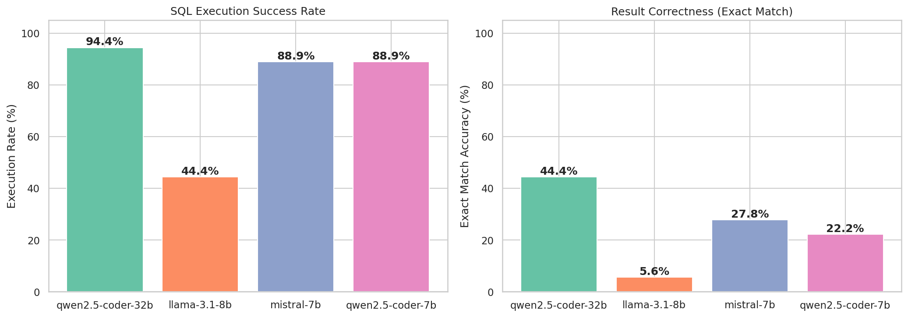

# Text-to-SQL Evaluation Pipeline

A systematic evaluation of open-source LLMs on text-to-SQL generation using the Chinook database, spanning 5 difficulty tiers from basic aggregations through complex CTE + window function combinations.

## Project Structure

```
text-to-sql-eval/
├── README.md
├── requirements.txt
├── .gitignore
├── Dockerfile
├── docker-compose.yml
├── .env.example
├── data/
│   └── chinook.db              # Chinook SQLite database
├── queries/
│   └── ground_truth.json       # 18 benchmark queries with ground truth SQL
├── src/
│   ├── __init__.py
│   ├── schema.py               # Database schema extraction
│   ├── llm_generator.py        # HuggingFace Inference API integration
│   ├── query_runner.py         # SQL execution and result comparison
│   └── evaluate.py             # Main evaluation pipeline
├── api/
│   ├── __init__.py
│   ├── main.py                 # FastAPI app entry point
│   ├── models.py               # Pydantic request/response schemas
│   └── routes/
│       ├── __init__.py
│       ├── health.py           # GET /health
│       └── generate.py         # POST /api/generate
├── results/
│   └── evaluation_results.json # Generated after running evaluation
└── notebooks/
    └── analysis.ipynb          # Visualization and analysis
```

## Setup

```bash
pip install -r requirements.txt
```

## Usage

### 1. Set your HuggingFace API token

```bash
export HF_TOKEN="hf_your_token_here"
```

Get a free token at [huggingface.co/settings/tokens](https://huggingface.co/settings/tokens).

### 2. Run the evaluation

```bash
python -m src.evaluate
```

This evaluates 4 models across 18 queries (72 total inference calls) and saves results to `results/evaluation_results.json`.

### 3. Analyze results

Open `notebooks/analysis.ipynb` to view accuracy charts, failure mode analysis, and per-concept breakdowns.

## Models Evaluated

| Model | HuggingFace ID | Parameters |
|-------|----------------|------------|
| Qwen2.5-Coder-32B | `Qwen/Qwen2.5-Coder-32B-Instruct` | 32B |
| Qwen2.5-Coder-7B | `Qwen/Qwen2.5-Coder-7B-Instruct` | 7B |
| Mistral-7B | `mistralai/Mistral-7B-Instruct-v0.2` | 7B |
| Llama-3.1-8B | `meta-llama/Llama-3.1-8B-Instruct` | 8B |

## Benchmark Queries

18 queries across 5 difficulty tiers:

- **Basic** (3 queries): Simple aggregations, JOINs, GROUP BY
- **Intermediate** (3 queries): Multi-table JOINs, subqueries, HAVING clauses
- **Window Functions** (4 queries): ROW_NUMBER, running totals, percentage calculations, LAG
- **CTEs** (4 queries): Multi-step aggregation, filtering on aggregates, derived metrics
- **Complex Combinations** (4 queries): CTEs + window functions, multi-level ranking, temporal analysis

## Evaluation Metrics

- **Execution Rate**: % of generated queries that execute without SQL errors
- **Exact Match Accuracy**: % of queries producing identical result sets to ground truth (order-insensitive)
- **Failure Mode Classification**: API error, execution error, empty result, wrong row count, wrong values

## Results Summary

| Model | Exec Rate | Exact Match | Best Tier | Worst Tier |
|-------|-----------|-------------|-----------|------------|
| Qwen2.5-Coder-32B | 94.4% | 44.4% | Window (75%) | Complex (0%) |
| Mistral-7B | 88.9% | 27.8% | Basic/Interm (67%) | Window/Complex (0%) |
| Qwen2.5-Coder-7B | 88.9% | 22.2% | Basic (67%) | CTE/Complex (0%) |
| Llama-3.1-8B | 44.4% | 5.6% | Basic (33%) | Everything else (0%) |




**Key finding — difficulty curve:** Accuracy degrades consistently as SQL complexity increases. The 32B model scores 67% on basic/intermediate queries and 75% on window functions, but drops to 25% on CTEs and 0% on complex combinations. The 7B models show an even steeper decline, and no model solves any complex-tier query.

**Scale matters:** The Qwen2.5-Coder-32B nearly doubles the accuracy of its 7B counterpart (44% vs 22%), with the biggest gains on window function queries (75% vs 25%).

See `notebooks/analysis.ipynb` for full charts, failure mode analysis, and per-query breakdowns.

## Interactive Playground (REST API)

A FastAPI layer exposes the SQL generation engine as an interactive playground for ad-hoc questions, separate from the batch evaluation pipeline.

The batch pipeline (`python -m src.evaluate`) runs all 18 benchmark queries with incremental resume support. The API serves a different purpose: ask any natural language question, pick a model, get SQL + execution results, and optionally compare against custom ground truth.

### Quick Start

```bash
# Local
cp .env.example .env   # then fill in HF_TOKEN
pip install -r requirements.txt
uvicorn api.main:app --reload

# Docker
docker compose up --build
```

### Endpoints

| Method | Path | Description |
|--------|------|-------------|
| GET | `/health` | DB connectivity and available models |
| GET | `/api/models` | List available models with HuggingFace IDs |
| POST | `/api/generate` | Generate SQL from a natural language question |

### Example Requests

```bash
# Health check
curl http://localhost:8000/health

# Generate SQL (playground)
curl -X POST http://localhost:8000/api/generate \
  -H "Content-Type: application/json" \
  -d '{"question": "List all customers from Brazil."}'

# Generate with accuracy check against ground truth
curl -X POST http://localhost:8000/api/generate \
  -H "Content-Type: application/json" \
  -d '{
    "question": "List all customers from Brazil.",
    "model": "qwen2.5-coder-32b",
    "ground_truth_sql": "SELECT FirstName, LastName, Email FROM Customer WHERE Country = '\''Brazil'\''"
  }'
```

### Docker

The `docker-compose.yml` maps port 8000, reads secrets from `.env`, and mounts `./results` for persistence. The Chinook database is baked into the image.

```bash
docker compose up --build    # build and start
docker compose down          # stop
```

## Key Design Decisions

- **Playground vs. batch separation**: The API exposes single-question generation for interactive exploration. Batch evaluation stays in the CLI, which has incremental resume logic that doesn't translate well to HTTP request/response.
- **Order-insensitive comparison**: Results are compared as sets, so equivalent queries with different ORDER BY clauses still match
- **Float normalization**: Floats rounded to 2 decimal places before comparison
- **Retry logic**: API calls retry up to 3 times with exponential backoff
- **SQL extraction**: Handles markdown code fences, inline SQL, and mixed text/SQL output
